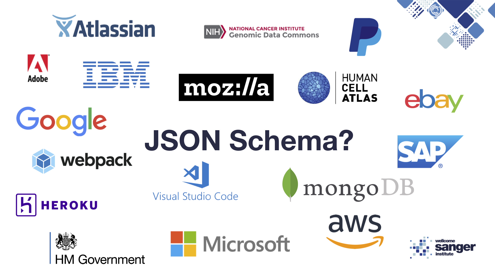

# jsonschema.dev

## What is this?

This is the repository for the code that runs the jsonschema.dev website.

jsonschema.dev is a web based JSON Schema playground.

JSON Schema is a vocabulary allow for the validation and annotation of JSON documents... and a [few](https://speakerdeck.com/relequestual/json-schema-intro-and-workshop-ga4gh-hinxton-2019?slide=10) [other](https://speakerdeck.com/relequestual/json-schema-intro-and-workshop-ga4gh-hinxton-2019?slide=21) [things](https://speakerdeck.com/relequestual/json-schema-intro-and-workshop-ga4gh-hinxton-2019?slide=22).

## Why?

Running the JSON Schema slack server has demonstrated there is no solution to easily test and share JSON Schema documents. There are other web based tools which offer a JSON Schema playground, however they run validation on the server, while jsonschema.dev runs all validation in browser using ajv.

This tool enables the JSON Schema community to find help easier in the same way jsfiddle enabled the javascript community to share and demo problems and solutions.

## JSON Schema?

The chances are that if you're here, you probably don't need selling on the idea that JSON Schema is pretty useful... but just in case:

JSON Schema is a personal IETF draft specification proposal. According to the IETF definition of personal drafts, it's not advised to actually use the specification, and is intended to test concepts and gather feedback, however JSON Schema has been used in production by many top companies for years.

The OpenAPI specification (formally Swagger) uses a subset of JSON Schema specification to define payloads.

The main javascript package for JSON Schema boasts many dependants, including Webpack and eslint.

The [most popular](https://insights.stackoverflow.com/survey/2019#development-environments-and-tools) text editor / IDE, Microsoft's VS Code, supports JSON Schema validation [out of the box](https://code.visualstudio.com/Docs/languages/json#_json-schemas-and-settings).

Here are some of the other companies and organisations that use JSON Schema, from a [presentation](https://speakerdeck.com/relequestual/json-schema-intro-and-workshop-ga4gh-hinxton-2019). (These are not endorsements.)

## Contributing

If you would like to contribute to this project, please follow this basic guide. A more detaild guide to follow.

 - Check to see if an issue for your suggestion or requirement already exists
 - Create a new issue detailing your suggestion or problem, including examples if possible
 - Issues that are approved (agreed on) are now awaiting a Pull Request
 - Pull Requests should always be made against the `develop` branch
 - Pull Requests should never be made against the `master` branch

This project uses [vue](https://vuejs.org).

It is expected that you have some familairty with CLI and node.

It's recommended that you use [nvm](https://github.com/nvm-sh/nvm) to install and manage node.

You will need to install node (probably using nvm) and then [yarn](https://yarnpkg.com/en/docs/install) (an alternative to npm).

Once installed, check out this git repository and run `yarn` with the repository root as your current working directory.

For local development, run `yarn run serve`.

For production build test, run `yarn run build`.

For more details, see the [Vue CLI docs](https://cli.vuejs.org).

jsonschema.dev is automagically deployed to [netlify](https://www.netlify.com) using the master branch.

Netlify also provides Pull Request previews, which will automagically appear when a PR is created or new commits are pushed to the associated branch.

## I have questions...

Super!

You can reach me on [twitter](https://twitter.com/relequestual) or on the [official json-schema.org slack](https://join.slack.com/t/json-schema/shared_invite/enQtMjk1NDcyNDI2NTAwLTcyYmYwMjdmMmUxNzZjYzIxNGU2YjdkNzdlOGZiNjIwNDI2M2Y3NmRkYjA4YmMwODMwYjgyOTFlNWZjZjAyNjg)

## I'd like to support this work

Great! Please see the sponsor links at the top of this page.
